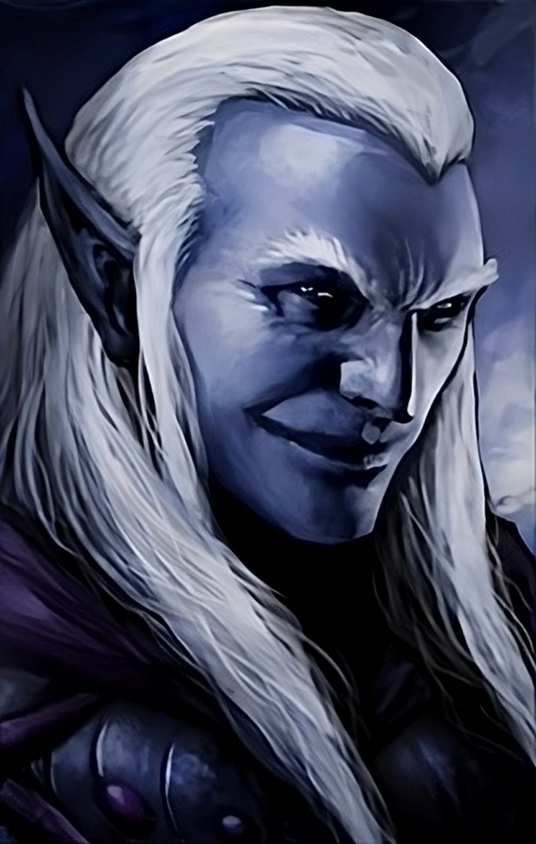

# Baeloth's in BG2

[](https://github.com/dark0dave/BaeBG2/releases/latest)
[](https://github.com/dark0dave/BaeBG2/releases/latest)
[](https://github.com/dark0dave/BaeBG2/releases/latest)
[](https://github.com/dark0dave/BaeBG2/actions/workflows/main.yaml)
[](./LICENSE)

This mod provides continuation for our lovable Baeloth in BG2EE and EET.



> OBVIOUSLY, this was going to happen, but the amount of TIME it took borders on insanity! How do you function on a day-to-day basis?

## Introduction

Baeloth is bored in the copper cornet, and longs for a real adventure.

### Collaboration

I must say a big thank you to [@Endarire](https://github.com/Endarire):[G3](https://www.gibberlings3.net/profile/5772-endarire/), who has provided dialogue and ideas for this mod. Without them, this mod would not be possible. A personal shout out to [@morpheus562](https://github.com/morpheus562):[G3](https://www.gibberlings3.net/profile/11591-morpheus562/), [@CamDawg](https://github.com/CamDawg):[G3](https://www.gibberlings3.net/profile/8-camdawg/), [@K4thos](https://github.com/K4thos):[G3](https://www.gibberlings3.net/profile/6804-k4thos/) for EET, and the rest of the G3 community. And to [@bucketfulofsunshine](https://github.com/bucketfulofsunshine) for their M'Khiin mod. And to [@zenblack](https://github.com/zenblack) for bams and dialogue! And to the [BEAR](https://github.com/szaumoor).

## Installation

We don't include an exe, you'll need use weidu to install:

### Move files

Copy zdbae subfolder to your game directory:

#### Linux/Macos:

```sh
cp -r BaeBG2/zdbae <GAME DIRECTORY>
```

#### Windows:

Copy files via explorer.exe

Then run weidu against the .tp2 file, in the game directory

#### Linux/Macos:
```sh
weidu zdbae/BaeBG2.tp2
```

#### Windows:
```sh
weidu.exe zdbae\BaeBG2.tp2
```

Should get something like this:

```sh
Using Language [English]
[English] has 1 top-level TRA files
[baebg2/tra/english/setup.tra] has 61 translation strings

Using ./lang/en_us/dialog.tlk

Install Component [Baeloth BG2]?
[I]nstall, or [N]ot Install or [Q]uit?
```

Enter I, then press enter and that's it!

```sh
SUCCESSFULLY INSTALLED      Baeloth BG2

Press ENTER to exit.
```

## Technical Notes

Baeloth files come from BGEE and SOD files:

- B.CRE
- BAELOTH.CRE (bg1ee)
- BAELOT7.CRE (sod)

### Portraits

DON'T FORGET 24bit depth for portraits

```sh
convert "${1}" -type truecolor "${1}"
```

### Dialogue

Add dialogue strings with the following:

```sh
weidu --nogame --traify-comment --traify-old-tra zdbae/tra/english/setup.tra  --traify zdbae/dialog/<target d file>
```

## Mirrors

- sourcehut https://git.sr.ht/~dark0dave/BaeBG2
- codeberg  https://codeberg.org/dark0dave/baebg2.git
- github    https://github.com/dark0dave/BaeBG2
- gitlab    https://gitlab.com/dark0dave/baebg2.git
